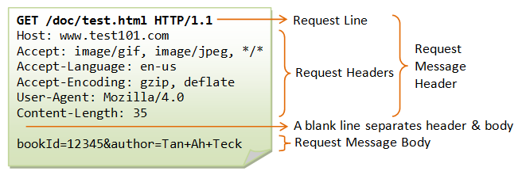

# GET과  POST의 차이

둘 다 HTTP 프로토콜을 이용해 서버에 요청(Request)할 때 사용하는 방식이다. 

GET은 서버에서 **데이터를 조회**하기 위해 사용된다. Http Request Message의 Header 부분의 URL에 데이터를 추가하여 전송하는 방식이다. 때문에 전송 가능한 데이터의 크기가 제한적이다. 또한 URL에 데이터가 노출되므로 보안적으로 중요한 데이터를 포함해서는 안된다.

POST는 **데이터를 추가, 수정**하기 위해 사용되는 방식이다. Post 방식의 request는 Http Request Message의 Body에 데이터를 추가하여 전송한다. 때문에 URL에 데이터가 노출되지 않아 GET에 비해 상대적으로 안전하다. (실질적으로 보안상 큰 차이는 없음)

GET 방식의 요청은 브라우저에서 Caching 할 수 있다. 때문에 POST 방식으로 요청할 것을 GET 방식으로 요청한다면 기존에 Caching 되었던 데이터가 응답될 가능성이 존재한다.

|  | GET 요청 | POST 요청 |
| --- | --- | --- |
| 사용 목적 | 데이터 조회 | 데이터 추가, 수정 |
| 데이터 위치 | Header | Body |
| URL 데이터 노출 여부 | O | X |
| URL 예시 | http://localhost:8080/detail?id=1 | http://localhost:8080/writeBoard |
| 데이터 전송 길이 제한 | O | X |
| Caching 가능 여부 | O | X |

<**참고: Http Request Message 구조>**
출처 : [https://gnaseel.tistory.com/23](https://gnaseel.tistory.com/23)

